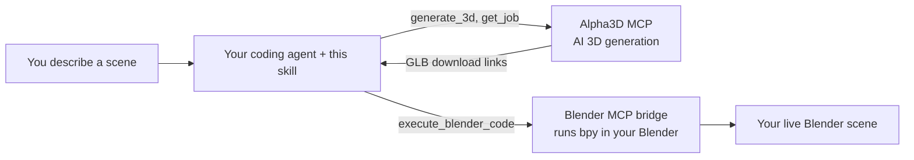

<div align="center">

# Alpha3D Scene Generator for Blender

**Describe a scene in plain English. Watch your AI agent generate the 3D models and build it in your open Blender file.**

An [Agent Skill](https://docs.claude.com/en/docs/agents-and-tools/agent-skills/overview) for [Claude Code](https://claude.com/claude-code), also usable in Cursor and OpenAI Codex, that connects [Alpha3D](https://alpha3d.io) AI 3D generation to a running Blender session.

<!-- Badges: replace OWNER/REPO once topics + license are set on GitHub -->


<br/>

<!--
  DEMO PLACEHOLDER. Record a 10-20s screen capture of a real scene build
  (see assets/README.md for the spec), save it as assets/demo.gif, then
  replace the italic line below with:
  
-->
_Demo video coming soon._

</div>

---

You say:

> *"I've got Blender open on an empty scene. Build me a small fantasy village: a stone well in the center, three different cottages around it, and a wooden cart by the entrance."*

Your agent then breaks the scene into individual assets, shows you exactly what each one will cost in Alpha3D credits, waits for your go-ahead, generates every model in parallel, and imports each one into your live Blender file, scaled to a sensible real-world size, dropped to the floor, and positioned into the layout you described. No manual export, download, or import.

## What it does

- **Turns a description into a plan.** It decides what genuinely needs AI generation (hero props, characters, organic shapes) versus what is cheaper as a plain Blender primitive (a flat floor, a simple crate), so you do not burn credits generating a cube.
- **Reuses what you already own.** If you refer to a model already in your Alpha3D library ("add my dragon from last week"), it finds and imports that one instead of regenerating it, for zero credits.
- **Never spends credits behind your back.** It always shows a per asset cost table and total against your current balance, then stops and waits for explicit confirmation before submitting anything.
- **Generates and imports end to end.** Text to 3D, image to 3D, and multi view, plus optional refinement (auto rig, retopology, UV unwrap, re texture, part segmentation) driven straight from the scene description.
- **Places assets like a scene, not a pile.** Bounding box scale normalization to a target size, drop to the ground plane, and layout reasoning (a circle "around the well", points "along the path", a spaced grid for a loose list), each asset grouped under its own named Empty.
- **Fails loudly and helpfully.** If the Blender bridge is not connected or a model comes back malformed, it tells you what is wrong and how to fix it instead of producing a cryptic error.

## How it works

This skill is pure orchestration. It plugs two MCP connectors together and does the scene reasoning in between.



1. **[Alpha3D MCP](https://alpha3d.io)** generates the actual 3D models and handles optional refinement (rigging, retopo, UV, texturing, segmentation).
2. **A Blender MCP bridge** (a Blender add on that exposes a local `bpy` code execution tool over MCP) lets the agent import and place assets inside your running Blender instance.

Your agent sequences both, downloads each generated model to local disk, sanitizes it for Blender's strict glTF loader, and imports it. See [`SKILL.md`](./skills/alpha3d-scenegen/SKILL.md) for the full step by step procedure.

## Prerequisites

| Requirement | Why | Notes |
|---|---|---|
| An **MCP capable coding agent** that runs on your machine: **Claude Code**, **Cursor**, or **OpenAI Codex CLI** | Runs the workflow and reaches Blender on your machine | This talks to a Blender instance on your own computer, so it will not work from a fully hosted sandbox with no local access. Per-client setup is below. |
| **An Alpha3D account with credits** + the **Alpha3D MCP connector** | Does the AI 3D generation | Generation spends real credits. Get an account at [alpha3d.io](https://alpha3d.io). |
| **Blender 4.x or 5.x**, open, with a **Blender MCP bridge** add on running | Lets the agent run `bpy` in your session | Any bridge exposing a `bpy` code execution MCP tool works. The common one is [BlenderMCP](https://github.com/ahujasid/blender-mcp). |

## Installation

The skill has two parts, and setup depends on your client:

1. **Two MCP connectors.** **Alpha3D** (remote, at `https://api.alpha3d.io/mcp`, with a browser OAuth step on first use) and a **Blender bridge** (a local stdio server, e.g. `uvx blender-mcp`).
2. **The skill's instructions.** The `skills/alpha3d-scenegen/` folder (`SKILL.md` plus `references/`). Claude Code loads these automatically as a skill or plugin. Cursor and Codex have no Agent Skills system, so you connect the same two MCP servers and point the tool at these instructions through its own rules file or `AGENTS.md`.

**The Blender side is identical for every client:** install a bridge add-on such as [BlenderMCP](https://github.com/ahujasid/blender-mcp) in Blender, and **start its server** (a button in the add-on's panel) each session. The per-client config below only tells your agent how to launch or reach that bridge, plus the remote Alpha3D server. You also need an [alpha3d.io](https://alpha3d.io) account with credits.

<details open>
<summary><b>Claude Code</b></summary>

**Install the skill.** The one-command path is the plugin marketplace:

```text
/plugin marketplace add ig-shadow-walker/3DGenSkill
/plugin install alpha3d-scenegen@alpha3d
```

`alpha3d` is the marketplace name, `alpha3d-scenegen` is the plugin; the skill loads automatically once enabled (requires Claude Code v2.1.143+). There is no `npx`/npm installer for Claude Code skills; this is the equivalent. To install manually instead, `git clone` this repo and copy the folder: `cp -r 3DGenSkill/skills/alpha3d-scenegen ~/.claude/skills/`.

**Connect both MCP servers:**

```bash
claude mcp add --transport http alpha3d https://api.alpha3d.io/mcp
claude mcp add blender -- uvx blender-mcp
```

Alpha3D prompts for browser authorization on first use (this links your account so generation draws from your credits). In Claude Desktop or claude.ai, add the same Alpha3D URL from **Settings > Connectors**.

</details>

<details>
<summary><b>Cursor</b></summary>

**Get the instructions locally:**

```bash
git clone https://github.com/ig-shadow-walker/3DGenSkill.git
# keep or copy the skills/alpha3d-scenegen/ folder inside your project
```

**Connect both MCP servers.** Add them to `.cursor/mcp.json` (project) or `~/.cursor/mcp.json` (global):

```json
{
  "mcpServers": {
    "alpha3d": { "url": "https://api.alpha3d.io/mcp" },
    "blender": { "command": "uvx", "args": ["blender-mcp"] }
  }
}
```

Open **Settings > MCP**, make sure both are toggled on, and for **alpha3d** click **Authenticate** to complete the browser OAuth (Cursor handles the flow natively; no credentials go in the file). If the login window never opens, toggle the server off and on, or restart Cursor.

**Load the instructions** as an always-on Project Rule at `.cursor/rules/alpha3d-scenegen.mdc`:

```md
---
description: Alpha3D + Blender 3D scene generation workflow
alwaysApply: true
---

When the user asks to generate, build, or populate a Blender scene with 3D
assets, follow the workflow in `skills/alpha3d-scenegen/SKILL.md` and its
`references/` files. Read them before acting.
```

</details>

<details>
<summary><b>OpenAI Codex CLI</b></summary>

Native remote MCP and OAuth landed in Codex in late 2025, so use a current version (`codex --version`, upgrade if `codex mcp login` is missing).

**Get the instructions locally:**

```bash
git clone https://github.com/ig-shadow-walker/3DGenSkill.git
# keep or copy the skills/alpha3d-scenegen/ folder inside your project
```

**Connect both MCP servers:**

```bash
codex mcp add alpha3d --url https://api.alpha3d.io/mcp
codex mcp login alpha3d        # opens the browser OAuth flow
codex mcp add blender -- uvx blender-mcp
```

Equivalently, edit `~/.codex/config.toml`:

```toml
[mcp_servers.alpha3d]
url = "https://api.alpha3d.io/mcp"

[mcp_servers.blender]
command = "uvx"
args = ["blender-mcp"]
```

**Load the instructions** by adding this to `AGENTS.md` (repo root, or `~/.codex/AGENTS.md` for all projects):

```md
## 3D scene generation in Blender

When the user asks to generate, build, or populate a Blender scene with 3D
assets, follow the workflow in `skills/alpha3d-scenegen/SKILL.md` and its
`references/` files. Read them before acting.
```

</details>

### Verify

Open Blender on a scene and start the bridge server, then describe a small scene to your agent. The skill runs a free preflight check on both connectors before proposing anything, so if a connection is missing it tells you immediately instead of failing deep into a build.

## Usage

Just describe what you want in your open Blender scene:

- *"Add a low poly goblin to my scene and rig it so I can pose it."*
- *"Fill this empty room: a wooden desk, a chair, a bookshelf against the back wall, and a desk lamp."*
- *"Generate a sci fi crate and drop three of them near the origin."*

Your agent will plan it, price it, ask you to confirm, then build it. You stay in control of every credit spent.

## Cost

Every generation and refinement step spends Alpha3D credits (full table in [`references/mcp_tools.md`](./skills/alpha3d-scenegen/references/mcp_tools.md)). Roughly: a generated model is 30 to 48 credits depending on quality, and optional passes like rigging, retopo, or texturing add more. Credits are debited when a job is submitted and **auto refunded if that job fails**. This skill always shows the full cost and waits for your confirmation before submitting.

## Repo layout

```
3DGenSkill/
├── .claude-plugin/
│   ├── plugin.json              # Plugin manifest
│   └── marketplace.json         # Marketplace catalog (powers /plugin install)
├── skills/
│   └── alpha3d-scenegen/
│       ├── SKILL.md             # The skill: the full procedure the agent follows
│       └── references/
│           ├── mcp_tools.md         # Verified Alpha3D MCP tool contracts + cost table
│           ├── blender_helpers.md   # Proven bpy code: download, sanitize, import, place
│           └── troubleshooting.md   # Known failure modes and their fixes
├── evals/
│   └── evals.json               # Test prompts for validating the skill
├── README.md
├── CONTRIBUTING.md
└── LICENSE
```

## Troubleshooting

The three things most likely to trip you up, with fixes, live in [`references/troubleshooting.md`](./skills/alpha3d-scenegen/references/troubleshooting.md):

- **"Cannot connect to Blender":** the bridge server is not running. Open Blender and start it from the add on panel (it does not survive a Blender restart).
- **"Bad GLB: file size doesn't match":** a malformed download. The skill's sanitize step handles this automatically.
- **A job stays processing for minutes:** normal. Real generation takes time.

## Contributing

Contributions are welcome. See [`CONTRIBUTING.md`](./CONTRIBUTING.md) for how to propose changes, and please open an issue for bugs or feature ideas.

## License

[MIT](./LICENSE).

---

<div align="center">
Built for <a href="https://alpha3d.io">Alpha3D</a>, the full AI 3D pipeline in one place.
</div>
