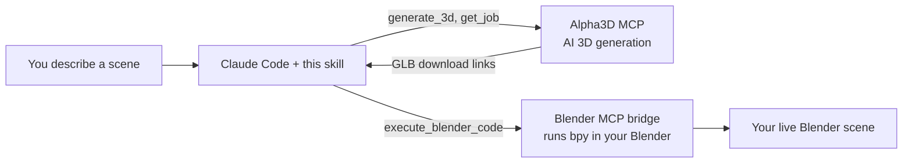

<div align="center">

# Alpha3D Scene Generator for Blender

**Describe a scene in plain English. Watch Claude generate the 3D models and build it in your open Blender file.**

An [Agent Skill](https://docs.claude.com/en/docs/agents-and-tools/agent-skills/overview) for [Claude Code](https://claude.com/claude-code) that connects [Alpha3D](https://alpha3d.io) AI 3D generation to a running Blender session.

<!-- Badges: replace OWNER/REPO once topics + license are set on GitHub -->


<br/>

<!--
  DEMO PLACEHOLDER. Record a 10-20s screen capture of a real scene build
  (see assets/README.md for the spec), save it as assets/demo.gif, then
  replace the italic line below with:
  
-->
_Demo video coming soon._

</div>

---

You say:

> *"I've got Blender open on an empty scene. Build me a small fantasy village: a stone well in the center, three different cottages around it, and a wooden cart by the entrance."*

Claude then breaks the scene into individual assets, shows you exactly what each one will cost in Alpha3D credits, waits for your go-ahead, generates every model in parallel, and imports each one into your live Blender file, scaled to a sensible real-world size, dropped to the floor, and positioned into the layout you described. No manual export, download, or import.

## What it does

- **Turns a description into a plan.** It decides what genuinely needs AI generation (hero props, characters, organic shapes) versus what is cheaper as a plain Blender primitive (a flat floor, a simple crate), so you do not burn credits generating a cube.
- **Reuses what you already own.** If you refer to a model already in your Alpha3D library ("add my dragon from last week"), it finds and imports that one instead of regenerating it, for zero credits.
- **Never spends credits behind your back.** It always shows a per asset cost table and total against your current balance, then stops and waits for explicit confirmation before submitting anything.
- **Generates and imports end to end.** Text to 3D, image to 3D, and multi view, plus optional refinement (auto rig, retopology, UV unwrap, re texture, part segmentation) driven straight from the scene description.
- **Places assets like a scene, not a pile.** Bounding box scale normalization to a target size, drop to the ground plane, and layout reasoning (a circle "around the well", points "along the path", a spaced grid for a loose list), each asset grouped under its own named Empty.
- **Fails loudly and helpfully.** If the Blender bridge is not connected or a model comes back malformed, it tells you what is wrong and how to fix it instead of producing a cryptic error.

## How it works

This skill is pure orchestration. It plugs two MCP connectors together and does the scene reasoning in between.



1. **[Alpha3D MCP](https://alpha3d.io)** generates the actual 3D models and handles optional refinement (rigging, retopo, UV, texturing, segmentation).
2. **A Blender MCP bridge** (a Blender add on that exposes a local `bpy` code execution tool over MCP) lets Claude import and place assets inside your running Blender instance.

Claude sequences both, downloads each generated model to local disk, sanitizes it for Blender's strict glTF loader, and imports it. See [`SKILL.md`](./SKILL.md) for the full step by step procedure.

## Prerequisites

| Requirement | Why | Notes |
|---|---|---|
| **Claude Code** (or another MCP capable Claude client with local execution) | Runs the skill and reaches Blender on your machine | This skill talks to a Blender instance on your own computer, so it will not work from a fully hosted sandbox with no local access. |
| **An Alpha3D account with credits** + the **Alpha3D MCP connector** | Does the AI 3D generation | Generation spends real credits. Get an account at [alpha3d.io](https://alpha3d.io). |
| **Blender 4.x or 5.x**, open, with a **Blender MCP bridge** add on running | Lets Claude run `bpy` in your session | Any bridge exposing a `bpy` code execution MCP tool works. The common one is [BlenderMCP](https://github.com/ahujasid/blender-mcp). |

## Installation

### 1. Install the skill

**Recommended: install as a plugin (two commands).** Claude Code ships with a plugin system, which is the closest thing to a one command install. In Claude Code, add this repo as a plugin marketplace, then install the plugin:

```text
/plugin marketplace add ig-shadow-walker/3DGenSkill
/plugin install alpha3d-scenegen@alpha3d
```

`alpha3d` is the marketplace name and `alpha3d-scenegen` is the plugin; the skill is bundled inside and loads automatically once the plugin is enabled. Requires Claude Code v2.1.143 or newer. Manage it later with `/plugin list`, `/plugin disable`, or `/plugin uninstall`.

> There is no `npx` or npm installer for Claude Code skills, and none is planned upstream. The plugin marketplace above is the one command equivalent.

**Alternative: manual install.** Copy just the skill directory into your Claude Code skills folder:

```bash
git clone https://github.com/ig-shadow-walker/3DGenSkill.git

# personal (available in every project)
cp -r 3DGenSkill/skills/alpha3d-scenegen ~/.claude/skills/

# ...or per project (available only inside one repo)
cp -r 3DGenSkill/skills/alpha3d-scenegen .claude/skills/
```

Either way, Claude Code discovers the skill from its `SKILL.md`. Run `/doctor` if you want to confirm it was picked up.

### 2. Connect the Alpha3D MCP connector

In Claude Code, add the Alpha3D MCP server and authenticate:

```bash
claude mcp add --transport http alpha3d https://api.alpha3d.io/mcp
```

On first use you will be prompted to authorize it in the browser, which links your Alpha3D account so generation draws from your credits (you need an account at [alpha3d.io](https://alpha3d.io) with credits available). In Claude Desktop or claude.ai, add the same URL from **Settings > Connectors** instead.

Verify it is live by asking Claude for your balance, or run the connector's `get_credit_balance` tool.

### 3. Connect a Blender MCP bridge

Install a Blender bridge add on such as [BlenderMCP](https://github.com/ahujasid/blender-mcp), following that project's README:

1. Install and enable its add on inside Blender.
2. **Start its server** from the add on's panel (this is separate from enabling it, and has to be done each time you launch Blender).
3. Register the bridge with Claude Code, for example:

```bash
claude mcp add blender -- uvx blender-mcp
```

The exact command depends on the bridge you choose, so follow its own instructions. What matters is that Claude ends up with a working `execute_blender_code` (or equivalent `bpy` execution) tool.

### 4. Verify everything is connected

Open Blender on a scene, start the bridge server, then in Claude Code just describe a small scene. The skill runs a free preflight check on both connectors before proposing anything, so if something is not wired up it will tell you immediately.

## Usage

Just describe what you want in your open Blender scene:

- *"Add a low poly goblin to my scene and rig it so I can pose it."*
- *"Fill this empty room: a wooden desk, a chair, a bookshelf against the back wall, and a desk lamp."*
- *"Generate a sci fi crate and drop three of them near the origin."*

Claude will plan it, price it, ask you to confirm, then build it. You stay in control of every credit spent.

## Cost

Every generation and refinement step spends Alpha3D credits (full table in [`references/mcp_tools.md`](./references/mcp_tools.md)). Roughly: a generated model is 30 to 48 credits depending on quality, and optional passes like rigging, retopo, or texturing add more. Credits are debited when a job is submitted and **auto refunded if that job fails**. This skill always shows the full cost and waits for your confirmation before submitting.

## Repo layout

```
3DGenSkill/
├── .claude-plugin/
│   ├── plugin.json              # Plugin manifest
│   └── marketplace.json         # Marketplace catalog (powers /plugin install)
├── skills/
│   └── alpha3d-scenegen/
│       ├── SKILL.md             # The skill: the full procedure Claude follows
│       └── references/
│           ├── mcp_tools.md         # Verified Alpha3D MCP tool contracts + cost table
│           ├── blender_helpers.md   # Proven bpy code: download, sanitize, import, place
│           └── troubleshooting.md   # Known failure modes and their fixes
├── evals/
│   └── evals.json               # Test prompts for validating the skill
├── README.md
├── CONTRIBUTING.md
└── LICENSE
```

## Troubleshooting

The three things most likely to trip you up, with fixes, live in [`references/troubleshooting.md`](./references/troubleshooting.md):

- **"Cannot connect to Blender":** the bridge server is not running. Open Blender and start it from the add on panel (it does not survive a Blender restart).
- **"Bad GLB: file size doesn't match":** a malformed download. The skill's sanitize step handles this automatically.
- **A job stays processing for minutes:** normal. Real generation takes time.

## Contributing

Contributions are welcome. See [`CONTRIBUTING.md`](./CONTRIBUTING.md) for how to propose changes, and please open an issue for bugs or feature ideas.

## License

[MIT](./LICENSE).

---

<div align="center">
Built for <a href="https://alpha3d.io">Alpha3D</a>, the full AI 3D pipeline in one place.
</div>
