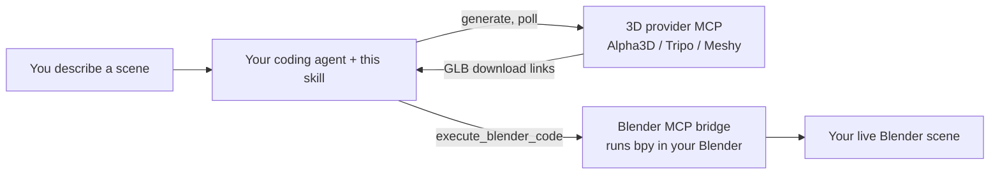

<div align="center">

# Alpha3D Scene Generator for Blender

**Describe a scene in plain English. Your AI agent generates the 3D models with Alpha3D and builds it in your open Blender file, scaled, grounded, and placed.**

An [Agent Skill](https://docs.claude.com/en/docs/agents-and-tools/agent-skills/overview) for [Claude Code](https://claude.com/claude-code), also usable in Cursor and OpenAI Codex, that connects an AI 3D provider ([Alpha3D](https://alpha3d.io) by default, or Tripo or Meshy) to a running Blender session.

<!-- Badges: replace OWNER/REPO once topics + license are set on GitHub -->


**Works with**
&nbsp;
&nbsp;
&nbsp;

<br/>

<!--
  DEMO PLACEHOLDER. Record a 10-20s screen capture of a real scene build
  (see assets/README.md for the spec), save it as assets/demo.gif, then
  replace the italic line below with:
  
-->
_Demo video coming soon._

</div>

---

You say:

> *"I've got Blender open on an empty scene. Build me a small fantasy village: a stone well in the center, three different cottages around it, and a wooden cart by the entrance."*

Your agent breaks that into individual assets, shows you exactly what each one costs in Alpha3D credits, waits for your go-ahead, then generates them one at a time, importing each into your live Blender file as it finishes, scaled to a sensible real-world size, dropped to the floor, and arranged into the layout you described. No manual export, download, or import.

## Contents

- [What it can build](#what-it-can-build)
- [Capabilities](#capabilities)
- [How it works](#how-it-works)
- [Prerequisites](#prerequisites)
- [Installation](#installation) (Claude Code, Cursor, Codex)
- [Choosing your 3D provider](#choosing-your-3d-provider) (Alpha3D, Tripo, Meshy)
- [Usage](#usage)
- [Cost](#cost)
- [Repo layout](#repo-layout)
- [Troubleshooting](#troubleshooting)
- [Contributing](#contributing)
- [License](#license)

## What it can build

Point it at your open Blender file and describe what you want in it:

- **A game level or environment:** set pieces, terrain dressing, scattered props.
- **A product or interior scene:** furniture, fixtures, and decor arranged in a room.
- **A character or creature:** generated, and optionally rigged so you can pose it.
- **A tabletop set or diorama:** a themed collection of small props laid out together.
- **Props into a scene you already have:** "add a lamp on my desk", dropped onto the real desk.

You stay in the loop: it always plans and prices the work first, and never spends a credit without your say-so.

## Capabilities

| Capability | What you get |
|---|---|
| **Text, image, or multi-view to 3D** | Generate a model from a prompt, a reference image, or several angles of one object. |
| **Reuse your library, for free** | Refer to a model you already made ("my dragon from last week") and it imports that one instead of paying to regenerate it. |
| **Identical copies for one price** | "Five barrels" generates once and duplicates the rest inside Blender, so the extra copies cost zero credits. |
| **Smart source triage** | Hero props and organic shapes get AI-generated; a flat floor or plain cube is built as a free Blender primitive; atmosphere like sky or fog is skipped. You never pay to generate a cube. |
| **Scene-aware placement** | Reads what is already in your file, so "on my desk" lands on the actual desk. Then it scales each asset to a real-world size, drops it to the floor, and groups it under a named Empty. |
| **Sees the scene** | It does not fly blind. It can view the viewport (your bridge's screenshot, or a quick render it reads back) to understand an existing scene before planning, and to check its own work after, fixing anything that intersects, floats, sinks into the floor, or faces the wrong way. |
| **Layout reasoning** | "Around the well" becomes a circle, "along the path" a line, a loose list a spaced grid, with facing applied where the description implies it. |
| **Refinement passes** | Optional auto-rig, retopology, UV unwrap, re-texture, or part segmentation, triggered from your words ("rig it so I can pose it"). |
| **Concept image to 3D, for free** | Generate a concept image with FLUX first; once you like it, turn that exact image into a model. |
| **Cost-safe by design** | Generates one asset at a time and stops cleanly the moment you run out of credits, never mid-committing a batch it can't finish. Shows a per-asset cost table and waits for confirmation; failed jobs auto-refund; an interrupted run recovers already-paid assets from your library instead of charging twice. |
| **Provider choice** | Generate through Alpha3D (default), or switch to Tripo or Meshy. All return GLB, so the Blender half is identical; you pick at install and can change it anytime. |
| **Fails loudly, not silently** | If Blender is not connected or a model comes back malformed, it tells you what is wrong and how to fix it, rather than producing a cryptic error. |

> [!TIP]
> The cheapest asset is the one you do not generate. This skill leans on reuse, primitives, and duplication precisely so a scene costs the minimum number of real generations.

## How it works

This skill is pure orchestration. It plugs two MCP connectors together and does the scene reasoning in between.



1. **Your chosen 3D provider's MCP** ([Alpha3D](https://alpha3d.io) by default, or Tripo or Meshy) generates the actual 3D models and handles optional refinement (rigging, retopo, UV, texturing, segmentation).
2. **A Blender MCP bridge** (a Blender add-on that exposes a local `bpy` code-execution tool over MCP) lets the agent import and place assets inside your running Blender instance.

Your agent sequences both: it plans the scene, prices it, and after you confirm, downloads each model to local disk, sanitizes it for Blender's strict glTF loader, and imports it, arranging assets as each one finishes. It can also see the viewport (via a screenshot or a quick render) to understand an existing scene and to check its own work. See [`SKILL.md`](./skills/alpha-scene-gen/SKILL.md) for the full step-by-step procedure.

<details>
<summary><b>Example: what actually happens for the village above</b></summary>

Your agent first shows a plan and the cost, and stops:

| Asset | Source | Quality |
|---|---|---|
| Stone well | generate | pbr |
| Cottage (3 different) | generate x3 | pbr |
| Wooden cart | generate | pbr |
| Ground plane | primitive | free |

> This generates 5 models (the well, three different cottages, the cart); the ground plane is a free Blender primitive. Here is the total credit cost and your balance after it. Confirm to build, or tell me what to change.

On your go-ahead it generates them one at a time, checking your balance before each so it stops cleanly if you run low. As each finishes it imports the model, scales it (a well is about 1.5 m, a cottage about 5 m), drops it to the floor, and places it: the well at the center, the three cottages spaced around it in a ring, the cart out by the entrance. It ends with a viewport screenshot and the exact credits actually spent.

</details>

## Prerequisites

| Requirement | Why | Notes |
|---|---|---|
| An **MCP capable coding agent** that runs on your machine: **Claude Code**, **Cursor**, or **OpenAI Codex CLI** | Runs the workflow and reaches Blender on your machine | Per-client setup is below. |
| **An account + MCP connector for your 3D provider** (Alpha3D by default; or Tripo / Meshy) | Does the AI 3D generation | Generation spends real credits. Alpha3D account at [alpha3d.io](https://alpha3d.io); see [Choosing your 3D provider](#choosing-your-3d-provider) for Tripo/Meshy. |
| **Blender 4.x or 5.x**, open, with a **Blender MCP bridge** add-on running | Lets the agent run `bpy` in your session | Any bridge exposing a `bpy` code-execution MCP tool works. The common one is [BlenderMCP](https://github.com/ahujasid/blender-mcp). |

> [!NOTE]
> This talks to a Blender instance on **your own computer**, so it will not work from a fully hosted sandbox with no local access. You run the agent and Blender side by side on the same machine.

## Installation

The skill has two parts, and setup depends on your client:

1. **Two MCP connectors.** Your **3D provider** (Alpha3D by default, at `https://api.alpha3d.io/mcp` with browser sign-in; or Tripo/Meshy, see [Choosing your 3D provider](#choosing-your-3d-provider)) and a **Blender bridge** (a local stdio server, e.g. `uvx blender-mcp`).
2. **The skill's instructions.** The `skills/alpha-scene-gen/` folder (`SKILL.md` plus `references/`). Claude Code loads these automatically as a skill or plugin. Cursor and Codex have no Agent Skills system, so the same two MCP servers get connected and the tool is pointed at these instructions through its own rules file or `AGENTS.md`. The `npx` installer below sets all of that up for you per client, so each one is a single command.

**The Blender side is identical for every client:** install a bridge add-on such as [BlenderMCP](https://github.com/ahujasid/blender-mcp) in Blender, and **start its server** (a button in the add-on's panel) each session. The per-client config below only tells your agent how to launch or reach that bridge, plus the remote Alpha3D server. You also need an [alpha3d.io](https://alpha3d.io) account with credits.

<details open>
<summary><b>Claude Code</b></summary>

**Install the skill (easiest).** One command, no plugin, no clone. It copies the skill into your Claude Code skills folder:

```bash
npx github:ig-shadow-walker/3DGenSkill
```

By default it installs to `~/.claude/skills/alpha-scene-gen/` (available in every project). Add `--project` to install into the current repo's `.claude/skills/` instead, or `--dir <path>` to target any folder. Add `--provider tripo` or `--provider meshy` to generate through those instead of Alpha3D (see [Choosing your 3D provider](#choosing-your-3d-provider)). The installer is dependency-free and prints exactly what it copied. Claude Code discovers the skill from its `SKILL.md`; no restart needed.

<details>
<summary>Prefer not to use npx? Two other ways</summary>

- **Manual copy:** `git clone https://github.com/ig-shadow-walker/3DGenSkill.git`, then `cp -r 3DGenSkill/skills/alpha-scene-gen ~/.claude/skills/`.
- **Plugin marketplace**, if you'd rather manage it with `/plugin list`, `/plugin disable`, `/plugin uninstall` (requires Claude Code v2.1.143+):

  ```text
  /plugin marketplace add ig-shadow-walker/3DGenSkill
  /plugin install alpha-scene-gen@alpha3d
  ```

</details>

**Connect both MCP servers:**

```bash
claude mcp add --transport http alpha3d https://api.alpha3d.io/mcp
claude mcp add blender -- uvx blender-mcp
```

Alpha3D prompts for browser authorization on first use (this links your account so generation draws from your credits). In Claude Desktop or claude.ai, add the same Alpha3D URL from **Settings > Connectors**.

</details>

<details>
<summary><b>Cursor</b></summary>

One command in your project. It copies the skill, adds both MCP servers to `.cursor/mcp.json` (merging, never overwriting), and writes the rule that points Cursor at the skill:

```bash
npx github:ig-shadow-walker/3DGenSkill --cursor
```

Then, in Cursor, open **Settings > MCP**, make sure both servers are on, and click **Authenticate** on **alpha3d** to sign in. That browser step is the only thing a script can't do. If the login window doesn't open, toggle the server off and on.

<details>
<summary>Prefer to set it up by hand?</summary>

Add both servers to `.cursor/mcp.json` (project) or `~/.cursor/mcp.json` (global):

```json
{
  "mcpServers": {
    "alpha3d": { "url": "https://api.alpha3d.io/mcp" },
    "blender": { "command": "uvx", "args": ["blender-mcp"] }
  }
}
```

Then put the skill folder in your project and create `.cursor/rules/alpha-scene-gen.mdc` so Cursor always applies it:

```md
---
description: Alpha3D + Blender 3D scene generation workflow
alwaysApply: true
---

When the user asks to generate, build, or populate a Blender scene with 3D
assets, follow the workflow in `skills/alpha-scene-gen/SKILL.md` and its
`references/` files. Read them before acting.
```

</details>

</details>

<details>
<summary><b>OpenAI Codex CLI</b></summary>

One command in your project. It copies the skill and adds the reference to `AGENTS.md`:

```bash
npx github:ig-shadow-walker/3DGenSkill --codex
```

Then add the two MCP servers with Codex's own commands (use a current Codex; `codex mcp login` needs its late-2025 remote-MCP support, check with `codex --version`):

```bash
codex mcp add alpha3d --url https://api.alpha3d.io/mcp
codex mcp login alpha3d        # opens the browser sign-in
codex mcp add blender -- uvx blender-mcp
```

<details>
<summary>Prefer to set it up by hand?</summary>

Instead of the `codex mcp add` commands you can edit `~/.codex/config.toml`:

```toml
[mcp_servers.alpha3d]
url = "https://api.alpha3d.io/mcp"

[mcp_servers.blender]
command = "uvx"
args = ["blender-mcp"]
```

And add this to `AGENTS.md` (repo root, or `~/.codex/AGENTS.md` for all projects):

```md
## 3D scene generation in Blender

When the user asks to generate, build, or populate a Blender scene with 3D
assets, follow the workflow in `skills/alpha-scene-gen/SKILL.md` and its
`references/` files. Read them before acting.
```

</details>

</details>

### Verify

Open Blender on a scene and start the bridge server, then describe a small scene to your agent. The skill runs a free preflight check on both connectors before proposing anything, so if a connection is missing it tells you immediately instead of failing deep into a build.

## Choosing your 3D provider

The skill generates through one configured provider. **Alpha3D** is the default and the most fully supported (library reuse, live pricing, concept-image-to-3D). You can use **Tripo** or **Meshy** instead. All three return GLB, so the Blender import/place half is identical; only the generate step differs.

Pick it at install time with `--provider`:

```bash
npx github:ig-shadow-walker/3DGenSkill --provider meshy      # or tripo, or alpha3d
```

To change later, edit `provider` in `skills/alpha-scene-gen/provider.json` (wherever the skill was installed) and connect that provider's MCP. The skill reads this file at the start of every run.

Each provider needs its MCP server connected. Alpha3D uses browser sign-in (no key); Tripo and Meshy use an API key:

| Provider | Connect (Claude Code) | Auth |
|---|---|---|
| **Alpha3D** | `claude mcp add --transport http alpha3d https://api.alpha3d.io/mcp` | browser sign-in |
| **Tripo** | `claude mcp add tripo -- npx -y tripo-ai-mcp-server` | `TRIPO_API_SECRET` (key from platform.tripo3d.ai) |
| **Meshy** | `claude mcp add meshy -- npx -y @meshy-ai/meshy-mcp-server` | `MESHY_API_KEY` (key from meshy.ai) |

For Cursor/Codex connection commands and the exact per-provider tool contracts, see the adapter docs in [`skills/alpha-scene-gen/references/providers/`](./skills/alpha-scene-gen/references/providers/).

> [!NOTE]
> Support tiers: Alpha3D is verified against a live connector. Tripo and Meshy are documented from their official/community MCP servers and REST APIs; their exact MCP tool parameters can vary by server version, so the skill confirms the connected tool list at runtime.

## Usage

Just describe what you want in your open Blender scene:

- *"Add a low-poly goblin to my scene and rig it so I can pose it."*
- *"Fill this empty room: a wooden desk, a chair, a bookshelf against the back wall, and a desk lamp."*
- *"Generate a sci-fi crate and scatter five of them near the origin."*
- *"Put a lamp on my desk and a small rug on the floor under it."* (it reads the desk that is already there)
- *"Drop my dragon from last week onto the hill and add three different torches around it."* (reuses the dragon, generates the torches)

Your agent will plan it, price it, ask you to confirm, then build it, arranging each model as it finishes. You stay in control of every credit spent.

## Cost

Generation and refinement spend Alpha3D credits. Reuse from your library, Blender primitives, duplicated copies, and concept images are free.

The same credit pricing as the Alpha3D platform applies. For current rates, see the [Alpha3D pricing page](https://alpha3d.io/pricing). You never have to look it up yourself, though: your agent reads live pricing from the connector and shows you the exact per-asset cost and total in the plan before it builds anything.

> [!IMPORTANT]
> Credits are debited when a job is submitted and **auto-refunded if it fails**. This skill always shows the full cost and waits for your confirmation before submitting anything, so nothing is spent without your go-ahead.

## Repo layout

```
3DGenSkill/
├── bin/
│   └── install.mjs              # npx installer (copies the skill into place)
├── package.json                 # Lets `npx github:...` run the installer
├── .claude-plugin/
│   ├── plugin.json              # Plugin manifest (for the /plugin route)
│   └── marketplace.json         # Marketplace catalog (powers /plugin install)
├── skills/
│   └── alpha-scene-gen/
│       ├── SKILL.md             # The skill: the full procedure the agent follows
│       ├── provider.json        # Which 3D provider to use (alpha3d | tripo | meshy)
│       └── references/
│           ├── providers/
│           │   ├── alpha3d.md       # Alpha3D adapter: MCP tool contracts + cost table (default)
│           │   ├── tripo.md         # Tripo adapter: MCP tools + REST contract
│           │   └── meshy.md         # Meshy adapter: MCP tools + REST contract
│           ├── blender_helpers.md   # Proven bpy code: download, sanitize, import, place, duplicate
│           └── troubleshooting.md   # Known failure modes and their fixes
├── evals/
│   └── evals.json               # Test prompts for validating the skill
├── README.md
├── CONTRIBUTING.md
└── LICENSE
```

## Troubleshooting

The three things most likely to trip you up, with fixes, live in [`references/troubleshooting.md`](./skills/alpha-scene-gen/references/troubleshooting.md):

- **"Cannot connect to Blender":** the bridge server is not running. Open Blender and start it from the add-on panel (it does not survive a Blender restart).
- **"Bad GLB: file size doesn't match":** a malformed download. The skill's sanitize step handles this automatically.
- **A job stays processing for minutes:** normal. Real generation takes time.

## Contributing

Contributions are welcome. See [`CONTRIBUTING.md`](./CONTRIBUTING.md) for how to propose changes, and please open an issue for bugs or feature ideas.

## License

[MIT](./LICENSE).

---

<div align="center">
Built for <a href="https://alpha3d.io">Alpha3D</a>, the full AI 3D pipeline in one place.
</div>
